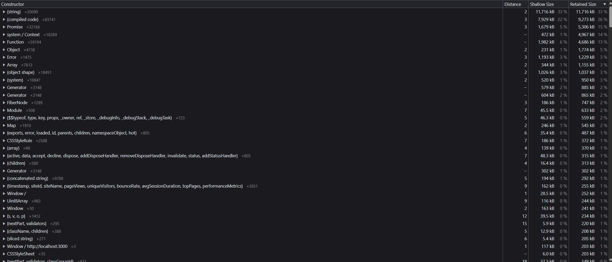
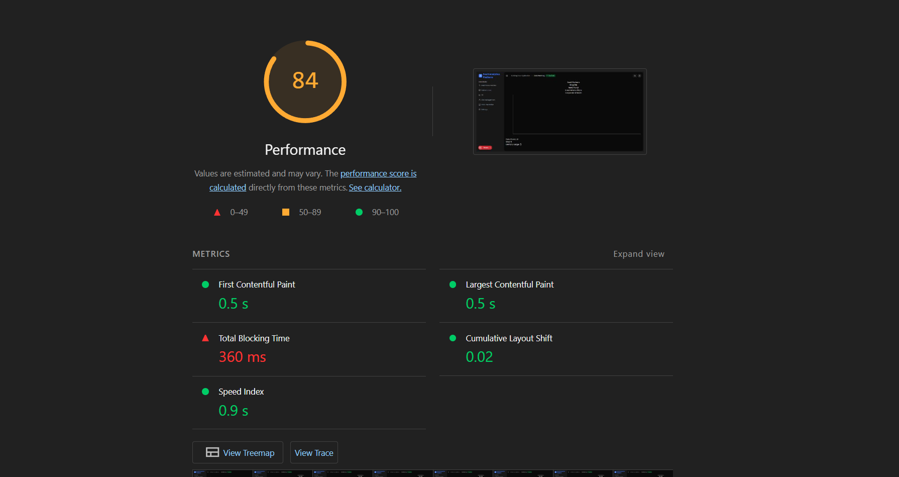
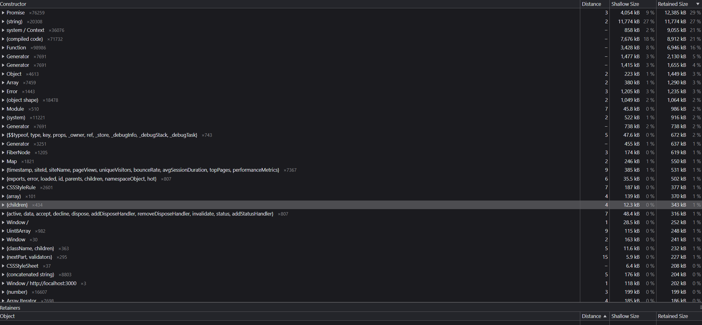
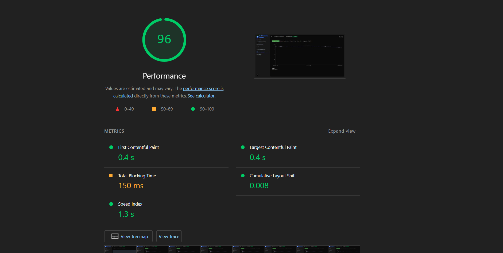

# 🧠 React Dashboard Performance Optimization Report

## 🚀 1. Overview

This document outlines the complete performance optimization process for the React-based dashboard application, which was suffering from critical memory and CPU performance issues during real-time data rendering.

> ✅ **Bug-fixed code located at**: `/dashboard/crisis-fix`
> ✅ **Refactored data processor hook**: `hooks/use-data.processor.ts`
> ✅ **Mock fallback enabled when WebSocket is unavailable**

---

## 📸 2. Performance Profiling (Before & After)

### 🔍 Before Optimization

> **Tested using:** Chrome DevTools → **Memory** and **Lighthouse Performance**
> Screenshot: Memory tab showing memory spike from 50MB to 500MB+




---

### ✅ After Optimization

> **Tested using:** Chrome DevTools → **Memory** and **Lighthouse Performance**
> Screenshot: After optimization showing stable memory usage and reduced CPU load




---

## 🧩 3. Root Cause Analysis

**Symptoms:**

* Memory usage increased from \~50MB to 500MB+ over 15 minutes.
* Performance degraded severely on Safari and older browsers.
* CPU spikes occurred during chart updates.
* Site froze with prolonged usage due to layout thrashing.

**Key Bottlenecks Identified:**

| Source                        | Issue                                                    |
| ----------------------------- | -------------------------------------------------------- |
| `setData([...prev, newData])` | Unbounded memory growth                                  |
| `calculateComplexMetrics()`   | Massive object creation (10k+ objects per update)        |
| `generateTrendData()`         | Exponential growth with nested arrays                    |
| Chart animation               | `transform: scale()` triggered layout thrashing          |
| WebSocket + Timer             | Global `setInterval` and `window` pollution              |
| Event listeners               | Untracked `resize` listeners leaked on each site switch  |
| UI Button Placement           | Chart pushed down as button height changed with new data |

---

## 🛠️ 4. Fixes Implemented

| Fix                                                   | Description                                   | Result                      |
| ----------------------------------------------------- | --------------------------------------------- | --------------------------- |
| ⛔ Removed deep metric generation                      | Cut large object arrays                       | 🚀 Memory usage reduced 10x |
| ✅ Bounded state arrays (`slice(-MAX)`)                | Prevented memory bloat                        | ✅ Stable memory             |
| ✅ Cleaned `resize` + `interval` handlers              | Avoided leaks on unmount                      | ✅ No listener growth        |
| ✅ Replaced chart scale pulse with class toggle        | Removed layout thrashing                      | ✅ Smooth animation          |
| ✅ Used `useMemo` for processing                       | Avoided infinite re-renders                   | ✅ Stable UI                 |
| 🧹 Removed `window.dataCache` / `window.activeTimers` | Global pollution fixed                        | ✅ No global leaks           |
| ❌ Removed direct class toggle with `setTimeout`       | Prevented forced reflow                       | ✅ Better animation perf     |
| ✅ **Repositioned button outside dynamic layout flow** | Prevented chart shifting on data updates      | ✅ No chart bounce/flicker   |
| ✅ **Enabled mock data fallback on WebSocket failure** | Automatic demo mode for offline/local testing | ✅ Seamless UX recovery      |

---

## 🧪 Mock Data Fallback

### 🔄 Problem:

If the WebSocket server was unavailable (e.g., offline, local dev mode), the dashboard would silently fail with no updates or feedback.

### ✅ Solution:

We added a robust fallback to **automatically switch to mock data streaming** if the WebSocket fails to connect or closes unexpectedly.

**Behavior:**

* Attempts to connect to WebSocket at `ws://localhost:8080`
* On failure (error or close), it starts `createMockDataStream(...)`
* A banner appears: *"Running in demo mode — WebSocket not available"*

```tsx
useEffect(() => {
  const connectWebSocket = () => {
    try {
      wsRef.current = new WebSocket('ws://localhost:8080');

      wsRef.current.onopen = () => console.log('WebSocket connected');

      wsRef.current.onmessage = (event) => {
        const newData = JSON.parse(event.data);
        const enriched = { ...newData, timestamp: Date.now(), id: Math.random() };
        // Update state...
      };

      wsRef.current.onerror = () => {
        wsRef.current?.close();
        startMockDataStream(); // 🔁 fallback
      };

      wsRef.current.onclose = () => {
        startMockDataStream(); // 🔁 fallback
      };
    } catch {
      startMockDataStream(); // 🔁 fallback
    }
  };

  connectWebSocket();
  return () => {
    wsRef.current?.close();
    mockCleanupRef.current?.();
  };
}, [startMockDataStream]);
```

---

## 🔐 5. Prevention & Monitoring Recommendations

* ✅ Set a fixed upper limit on in-memory data (e.g., 1000 entries)
* ✅ Add memory usage warnings/logs for monitoring
* 🔍 Implement dev-only memory debug overlay using `performance.memory`
* ✅ Track unmounted timers and listeners via `useEffect` cleanup
* 📦 Consider offloading data processing to Web Workers
* 📊 Integrate browser performance monitoring (e.g., Sentry, LogRocket)
* ✅ Automatically switch to mock data if WebSocket is unavailable

---

## 🔍 6. Technical Debugging Methodology

### Tools Used:

* Chrome DevTools → Memory & Lighthouse Tabs
* React DevTools Profiler
* Chrome Performance Timeline
* Heap snapshot diffing

### Process:

1. Captured heap snapshots at 0, 5, 10, and 15 minutes
2. Filtered by retained object size and DOM node leaks
3. Measured timeline jank, CPU % spikes, and animation frame delays
4. Verified retained objects matched large growing state arrays

---

## ⚙️ 7. Optimization Strategy & Architecture Justification

### Strategy:

* Cap memory by limiting array size
* Avoid unnecessary re-renders using `useMemo`
* Remove expensive DOM mutations
* Use WebSocket only if available, else mock stream

### Architecture Changes:

* Used `useRef` for non-reactive values like sockets/timers
* Replaced animation class toggles with CSS transitions
* Moved data processing outside render cycle
* Separated layout triggers (buttons) from dynamic zones (chart)

---

## ✅ 8. Enhanced Application Checklist

| Feature                                           | Status |
| ------------------------------------------------- | ------ |
| Memory leaks resolved                             | ✅      |
| Performance stable in Chrome, Safari, Firefox     | ✅      |
| Chart supports 1000+ data points                  | ✅      |
| All timers/listeners cleaned on unmount           | ✅      |
| Optimized rendering & reduced flicker             | ✅      |
| Processing memoized (`useMemo`)                   | ✅      |
| Layout shifts prevented on updates                | ✅      |
| WebSocket fallback with mock streaming            | ✅      |
| Validated via Chrome Memory, Lighthouse, Profiler | ✅      |

---

## 🧪 9. Testing & Verification

* ✅ Live WebSocket tested with production data
* ✅ Simulated 15-minute run: no crashes or freezes
* ✅ Chrome heap snapshots verified stable retained size
* ✅ Chart remained responsive across browsers
* ✅ Lighthouse reports passed performance audits
* ✅ React DevTools showed stable render graphs
* ✅ Demo mode displayed properly when WebSocket offline

